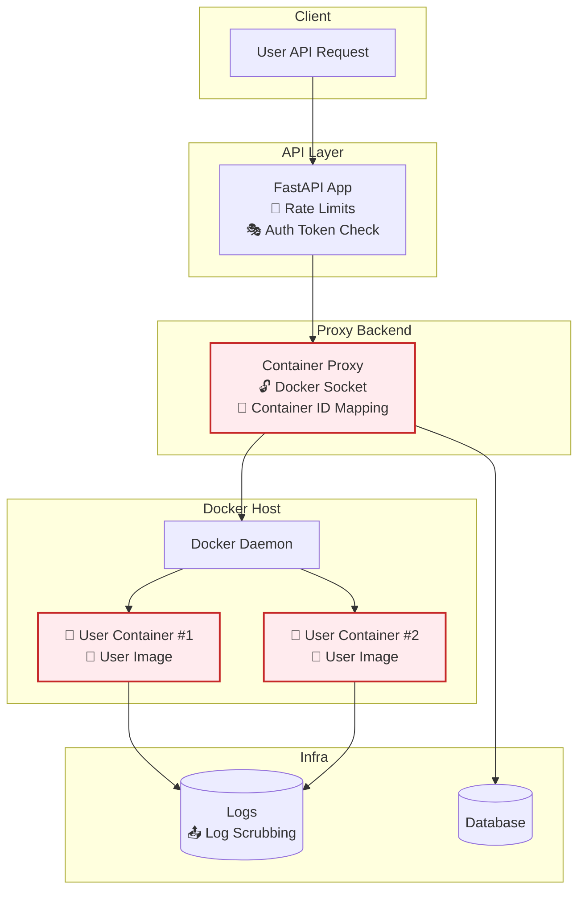

> [!WARNING]
> This page is **legacy / archived** and may be outdated.
> It is preserved for historical context only and is **not** the source of truth for current operations.
>
> Use current documentation instead:
- [Architecture-Overview](../development/architecture.md)
- [Contributing-&-CI](../development/contributing-ci.md)
>
> You can also start from [Archive / Legacy Index](index.md).

---

# A Tale of Two Proxies


Let's assume we've implemented the ultimate middleware layer that sits between users and the Docker API, authenticating requests and routing them to appropriate stacks based on tenant labels. Users get their own isolated view of the Swarm, APIs are secured, and everyone's happy.

*Then, the proxy node gets compromised.*

Suddenly, an attacker has access to the component that validates user identities and makes authorization decisions. If the proxy holds authentication tokens, session data, or worse—direct access to backend services—the attacker can potentially impersonate any user in the system. They could deploy malicious containers under legitimate tenant labels, access other users' services, or extract sensitive data from across the cluster.

The key insight here is that compromising the proxy effectively compromises the entire multi-tenant boundary. It's like having someone break into the security checkpoint at an airport—they don't just get through themselves, they can wave anyone else through too.

---

We've just hit the tip of the iceberg however. I present you with a list of how **everything** can go wrong:

#### Threat Model

| **Threat**                                 | **Description**                                                                                             | **Impact**                                            | **Affected Goal**                                        | **Mitigation**                                                                                                            |
| ------------------------------------------ | ----------------------------------------------------------------------------------------------------------- | ----------------------------------------------------- | -------------------------------------------------------- | ------------------------------------------------------------------------------------------------------------------------- |
| **🧨 Container breakout**                     | A malicious user gains shell access and escapes their container using kernel exploits or misconfigurations. | Host compromise, lateral movement to other containers | Prevent proxy compromise from becoming system compromise | Use rootless containers, seccomp profiles, AppArmor/SELinux, and user namespaces.                                         |
| **🔓 Privilege escalation via Docker socket** | Proxy has access to Docker socket, which can control the entire host if exposed or misused.                 | Full system compromise                                | Prevent proxy compromise from becoming system compromise | Avoid exposing the raw Docker socket; use scoped Docker API wrappers or Docker contexts with limited permissions.         |
| **🎭 API key/token theft**                    | An attacker steals a user's API token and impersonates them.                                                | Unauthorized container access                         | Prevent identity spoofing                                | Use short-lived tokens, rotate secrets, enforce mTLS, and validate auth on every request.                                 |
| **🐍 Insecure container images**              | Users (or you) run images from untrusted sources containing malware or backdoors.                           | Container acts as foothold or DDoS agent              | Prevent proxy compromise & cross-container abuse         | Use a private image registry, scan images with tools like Trivy/Clair, enforce signed images with Notary or cosign.       |
| **🔗 Cross-container network access**         | One user's container can connect to another's via internal Docker network.                                  | Data leakage or command injection                     | Prevent access to another user’s containers              | Place each user’s container in an isolated Docker network. Use firewall rules (e.g., eBPF, iptables) to enforce policy.   |
| **🚨 Proxy API abuse (DoS or flooding)**      | A user spams the API, triggering excessive container spawns.                                                | Exhausts system resources, disrupts availability      | Prevent proxy compromise                                 | Implement rate limiting (e.g., SlowAPI), quota systems, and monitor usage patterns.                                       |
| **🧩 Container ID spoofing**                  | A user guesses or manipulates container identifiers in requests.                                            | Gain control or insight into another user’s instance  | Prevent identity spoofing, enforce tenant boundaries     | Never expose internal container IDs. Map user sessions to internal IDs server-side, enforce strict access control checks. |
| **📤 Log leakage**                            | Sensitive container output is written to shared or improperly secured logs.                                 | Data leakage between users                            | Prevent access to other users’ containers                | Isolate logs per container. Scrub sensitive output. Avoid stdout piping unless sanitized.

#### Visualization



---

TL;DR:

- The **proxy process controls all access** to the Docker daemon

- A **compromise of the proxy** gives the attacker full control over:

    - Creating containers

    - Reading logs

    - Killing or inspecting containers of **any user**

- If **users are only identified by a header or JWT**, an attacker who gets proxy control can **forge identities** and impersonate other users

---

## Introducing: Security

As you've probably noticed, different attack vectors can surface across various layers of our setup.

Does that mean we need to solve **everything** right away? Definitely not.

What matters most is staying disciplined with the tools we already have — keeping the system tidy, secure, and well-scoped as it grows.

This is why we should follow a **SECURITY BY DESIGN** approach from the start. It helps us build on solid ground and saves us from reinventing the wheel — or patching over architectural gaps — later on.

In order to explain the core principles, I'll tackle some the threats mentioned above. I don't want to delegate development time to in-house solutions since this would go way beyond the responsibilities of most of the contributors in this project.

Let's keep it (as) simple (as possible), shall we?

---

## 🔓 Container Breakout — The Elephant in the Namespace

Container breakout is one of those threats that feels rare — right until it isn’t. In our case, where users can spawn containers through an API, it’s something we can’t afford to ignore. If an attacker escapes a container, they could potentially compromise the worker node entirely, gaining access to the underlying host and other containers running alongside. Game over.

### Where We're Most Exposed

Because we allow users to run containers from pre-approved images, the assumption is that the code *inside* is at least semi-trusted — but that doesn’t mean it’s immune to abuse. A single misconfigured capability, overly generous mount, or kernel CVE can become the weakest link.

For example:

- If an attacker manages to trick the container into mounting sensitive host paths (even read-only ones), they can start probing system files or pulling credentials.
- If the container has unnecessary privileges, it might be able to manipulate cgroups, escape namespaces, or access raw devices.

And since Docker shares the kernel with the host, a kernel exploit in a container is a kernel exploit on the node.

### What's Already Covered

We’ve already ruled out the big red flags:

- No containers are launched with `--privileged`
- The Docker socket (`/var/run/docker.sock`) stays outside of user containers
- Role-based access control (via Portainer EE) limits what a user can deploy

So we're off to a strong start. But isolation isn’t just about blocking root access — it’s about limiting what even a fully-compromised container can do.

### Strengthening the Walls

There are still several practical measures we can adopt without turning this into a full-blown Kubernetes project.

First, we should look at **dropping unnecessary Linux capabilities**. Containers come with a surprisingly permissive set of defaults — and most workloads don’t need them. Using something like:

```bash
docker run --cap-drop=ALL --cap-add=NET_BIND_SERVICE ...
```

lets us be explicit about what each container actually needs.

Another easy win is read-only root filesystems. Unless the container explicitly needs to write to `/`, locking it down is a clean way to reduce the attack surface.

If we want to go further, we can start experimenting with seccomp profiles. The default Docker seccomp profile is already decent, but custom profiles give us more control over what syscalls should be blocked. Think of this as setting ground rules for what code is even allowed to ask the kernel to do (More details below).

And lastly, Swarm-level node constraints give us some flexibility. We can dedicate specific worker nodes to user workloads, keeping anything sensitive — like database services or internal tools — far away (More details below). If things go wrong in a container, we can contain the damage to a subset of our infrastructure.

We do need to acknowledge that container breakout is a real class of risk — especially in a setup where users are effectively deploying code. Thankfully, Docker gives us enough room to tighten things up without getting in the way of usability.

---

## 👥 Identity Enforcement - Made Easy

We started with JWTs — and that got us part of the way. Each request passed through the proxy came with a signed token, identifying the user and their group. Simple, clean, and decoupled from the Docker API. But the deeper we go, the more clear it becomes: **JWTs don’t provide enforcement.**

They just carry claims — and it’s still up to us to validate those claims, scope the user correctly, filter container access, and avoid privilege escalation.

That’s a lot of logic to design into a homegrown proxy. And the moment you want something like **read-only roles**, **namespace scoping**, or **auditing**, things get messy fast. You either build it all yourself — or you find a layer that does it well.

### ✅ Portainer EE: A Drop-In for Real RBAC

To avoid rebuilding the wheel (and debugging it for months), I formally propose [**Portainer EE**](https://www.portainer.io/portainer-business) as a dedicated RBAC layer between our API and the Docker API.

Portainer acts as a **policy engine and dashboard** for container infrastructure, but more importantly:

- It supports **role-based access control** out of the box
- You can define **teams**, **environments**, and **resource ownership**
- All Docker requests are filtered and enforced through its internal policy layer
- It offers **API-level integration**, meaning our own services can authenticate, delegate, and act on behalf of users

In this model, our FastAPI app doesn’t need to talk directly to Docker. It talks to Portainer’s API, which **validates identity and scopes access** based on configured rules. It also centralizes container metadata, audit logs, and user actions — things that would be painful (or insecure) to track ourselves.

### Code design

With `docker-py`, you'd usually connect directly to the Docker daemon and manage container lifecycle yourself — meaning:

* You need to track ownership manually

* You have to enforce identity and permissions in your own app

* You become responsible for separating users, namespacing services, and stopping abuse

With Portainer EE, all of that logic is offloaded:


```python
import requests

# Portainer instance
PORTAINER_HOST = "https://portainer.example.com/api"

# Login credentials (ideally use environment variables or secrets)
USERNAME = "alice"
PASSWORD = "<portainer-password>"

# Authenticate to Portainer to get a JWT token
resp = requests.post(
    f"{PORTAINER_HOST}/auth",
    json={"Username": USERNAME, "Password": PASSWORD}
)
token = resp.json()["jwt"]

# Prepare headers for authenticated requests
headers = {
    "Authorization": f"Bearer {token}",
    "Content-Type": "application/json"
}

# Example: Deploy a stack from a compose file
stack_payload = {
    "Name": "alice-monitoring",
    "StackFileContent": open("docker-compose.yml").read(),
    "Env": [],
    "Prune": True
}

# Deploy to endpoint 1 (e.g. Docker Swarm cluster)
response = requests.post(
    f"{PORTAINER_HOST}/stacks",
    headers=headers,
    params={"type": 1, "method": "string", "endpointId": 1},
    json=stack_payload
)

if response.ok:
    print("Stack deployed successfully!")
else:
    print("Failed to deploy:", response.text)
```

---

Summing up:

| Feature              | `docker-py` Approach         | Portainer EE Approach                |
| -------------------- | ---------------------------- | ------------------------------------ |
| Identity enforcement | You build it (JWT, headers)  | Built-in user/team auth              |
| RBAC                 | Manual logic per request     | Native, configurable in UI/API       |
| Container ownership  | Track via labels or metadata | Handled per team/environment         |
| Stack isolation      | Needs strict naming/IDs      | Enforced by Portainer’s access model |
| Audit trail          | Manual logging (if any)      | Centralized logs in Portainer        |

By introducing a dedicated identity and access layer like Portainer EE, we decouple our application logic from the underlying enforcement logic. That gives us:

- Cleaner architecture
- Easier compliance
- Better long-term flexibility

It also means we can **standardize on secure access patterns** across all environments — from development to staging to production — without writing brittle ad-hoc access logic for each.

---

## ⚙️ Resource Isolation - Boundaries Set

Even with RBAC in place, access control alone doesn’t stop one user's container from hogging all the system resources. The next line of defense is resource isolation, and in a Docker Swarm context, we actually have solid primitives to enforce it — we just need to use them intentionally.

### Docker Swarm Has the Tools

Each service definition supports `deploy.resources.limits` and `deploy.resources.reservations`, which let you declare exactly how much CPU and memory a container is allowed to use. In a shared environment, these limits aren’t optional — they’re essential. Otherwise, one misconfigured workload could grind an entire node to a halt.

Here's a minimal example of what a resource-constrained service might look like:

```yaml
services:
  api:
    image: myregistry/user-api:latest
    deploy:
      resources:
        limits:
          cpus: '0.50'
          memory: 256M
        reservations:
          cpus: '0.25'
          memory: 128M
```
This ensures the container won’t exceed 0.5 CPUs or 256MB RAM — and it gives the scheduler a baseline to work with when placing containers.

### How This Plays with Portainer

Portainer makes it easy to enforce and visualize these resource constraints when deploying a stack. Teams can define their limits per service, and administrators can audit or predefine templates with sane defaults. This is key if you’re onboarding less experienced contributors — you can guide them into good deployment habits without gatekeeping the process.

### Any Hard Guarantees?

While Docker Swarm doesn’t support strict kernel-level isolation like Kubernetes namespaces or cgroups v2 slices, resource limits backed by the container runtime (usually `containerd`) still provide strong enough guarantees for most practical workloads.

That said, if your containers run untrusted code, or perform sensitive I/O, consider pairing resource limits with runtime flags like:

* `--read-only`

* `--cap-drop`

* User namespaces (`--user` or `--security-opt`)

These don’t replace resource limits — they complement them by locking down what the container can do, not just how much it can consume.

#### TL;DR

Isolation starts at deployment. You can’t trust any kind of user to behave, and you shouldn’t have to. Enforcing sane resource limits upfront makes the cluster safer, more stable, and much easier to debug when things go sideways.

---

## Metwork Segmentation (WIP)

---

## Audit Logging (WIP)

---

## Image signing (WIP)

---

# Notes

## 🧪 Security Without Breaking Developer Flow

Let’s face it — the tighter you make a system, the harder it often gets to use. But when your platform lets users spawn containers through an API, usability can’t be an afterthought. The real challenge is designing guardrails that don’t feel like roadblocks.

In our current setup, we’re already doing a lot right:

- Pre-approved base images reduce the risk of unknown code
- Docker Swarm abstracts away some of the networking and scheduling pain
- Portainer EE introduces just enough RBAC to let users manage their own space without stepping on each other

But how do we push further without losing what makes the developer experience intuitive and fast?

### 🔍 Transparency Over Friction

Instead of forcing hard constraints blindly, we should aim to make limitations **visible and explainable**. If a user hits a restriction — like not being able to expose a certain port or mount a host path — they should know why. This could mean surfacing policy violations via API responses or Portainer’s UI, or even preemptively validating their compose files before they ever hit the scheduler.

It’s better to educate than silently fail.

### 🧰 Templates, Not Blank Slates

Rather than letting users build containers from scratch, we can provide curated compose stacks that follow all our isolation and policy rules. Think of them as secure-by-default blueprints. These stacks can still be parameterized — for ports, resources, or environment variables — but the underlying structure stays safe.

This approach removes guesswork, speeds up deployment, and keeps security guarantees intact.

### 📦 Build Once, Deploy Safely

Eventually, we can explore **automated CI pipelines** that verify container builds against our security policies before they’re ever deployed to Swarm. That means:

- Verifying image signatures (e.g. Cosign or Docker Content Trust)
- Scanning for vulnerabilities (Trivy, Grype)
- Linting for unsafe Dockerfile practices

Once approved, these builds go into a private registry, and users can deploy them as stacks without worrying about the details. They focus on their service logic; we keep the surface area locked down.

---

Security isn’t about slowing things down — it’s about removing unknowns.
