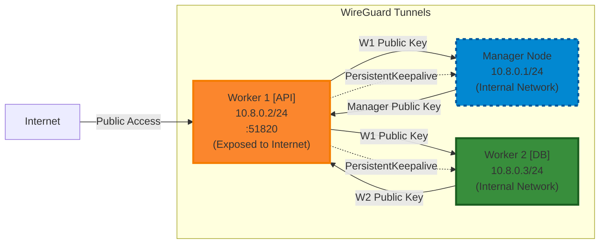

> [!WARNING]
> This page is **legacy / archived** and may be outdated.
> It is preserved for historical context only and is **not** the source of truth for current operations.
>
> Use current documentation instead:
- [Deployment-Modes](../operations/deployment-modes.md)
- [Architecture-Overview](../development/architecture.md)
>
> You can also start from [Archive / Legacy Index](index.md).

---

# Motivation

Based on [my previous PoC](container-management-poc.md#whats-next), the natural next step was to explore how it would behave in a multi-host environment.

This transition brings potential scalability, redundancy, and real-world production scenarios.

However, it also introduces new challenges around networking, multi-tenancy and security implications.

---

## Kubernetes, Kubernetes


Kubernetes is clearly a strong contender for managing any multi-host setup. Its comprehensive security features—like RBAC, network policies, pod security standards, and secrets management—would add a layer of protection for our monitoring services. Plus, the idea of deploying our MQTT monitoring containers as Kubernetes pods, with automated health checks, resource limits, and self-healing restart policies, sounds appealing.

For instance, consider load distribution across different FastAPI instances—some nodes can get overloaded while others sit idle. Kubernetes’ built-in service discovery and load balancing would help optimize resource usage. And for our databases, having persistent storage managed at the cluster level would simplify backups and recovery compared to any manual approach.

## Reality Check

As powerful as you let Kubernetes to be, it comes with a steep learning curve that could create *significant* friction for working students and new contributors who want to jump into the project.

Setting up a local development environment requires understanding concepts like clusters, nodes, namespaces, ingress controllers, and storage classes. Contributors would need to install tools like kubectl, configure cluster contexts, understand YAML manifests, and navigate the complexity of networking. This overhead might quickly discourage enthusiastic developers who simply want to contribute to the core monitoring functionality without becoming Kubernetes experts first.


## Looking for Alternatives

Let's examine all the orchestration options available to us at the time of this draft (05/2025):

| Orchestration Solution | Learning Curve | Community Support | Production Readiness | Multi-Host Networking | Security Features | Long-term Viability | Resource Requirements |
|---------------------|--------------|--------------------|--------------------|--------------------|------------------|-------------------|---------------------|
| **Single Host Docker** | Minimal | Excellent | Good for small scale | None | Basic container isolation | Stable but limited | Very low |
| **Docker Swarm** | Low to Medium | Limited | Good | Built-in overlay networks | TLS encryption, secrets management | Questionable | Low |
| **Kubernetes** | High | Excellent | Excellent | Advanced CNI plugins | RBAC, network policies, PSS | Excellent | Medium to High |
| **Nomad** | Medium | Growing | Good | Consul integration required | ACLs, TLS | Good | Medium |
| **Amazon ECS** | Medium | AWS ecosystem | Excellent | AWS VPC integration | IAM integration, task roles | Tied to AWS | Medium |
| **Docker Compose + External LB** | Low | Good | Fair | Manual configuration | Basic | Limited scalability | Low |
<br>

After weighing these considerations, I proposed to start our multi-host setup with **Docker Swarm Mode** instead. This choice represents a perfect middle ground between single-host simplicity and full-scale orchestration capabilities.

---
> Let's be honest here - this decision deserves some scrutiny.
> <br> <br> In an era where Kubernetes has become the de facto standard for container orchestration, choosing Docker Swarm might seem like picking a horse-drawn carriage over a VW Amarok. Docker Inc. has shifted their focus heavily toward Kubernetes support, and the container orchestration ecosystem has largely consolidated around Kubernetes. This means fewer updates, a smaller community, and potentially limited long-term viability.
---

# The Swarm

## Understanding the Swarm


Docker Swarm Mode operates on familiar Docker primitives that contributors might already understand. It transforms a group of Docker engines into a single, logical Docker cluster.

**Services** in Swarm are conceptually similar to the containers we're already managing, but with built-in scaling, rolling updates, and failure recovery. The networking model uses **overlay networks** that allow containers on different hosts to communicate as if they were on the same machine, which serves as an excellent abstraction layer.

From a deployment perspective, Swarm services can be defined using **Docker Compose** files with minimal modifications to what developers might already be using locally. This means the learning curve for contributors is much gentler, focusing on understanding concepts like service replicas, placement constraints, and rolling updates rather than entire orchestration paradigms.

You'll find everything you need to understand it in the [official docs](https://docs.docker.com/engine/swarm/).

## Preparing the Swarm

The experimental deployment we're planning will distribute our FastAPI instances across multiple nodes in the Swarm. Our database will likely run as a replicated service with persistent volumes, ensuring data consistency across the cluster. The MQTT monitoring containers will benefit from Swarm's ability to automatically reschedule failed tasks and distribute workload based on node capacity.

To begin with, we’ve adapted our existing `docker-compose.yml` into a new `docker-compose.qa-swarm.yml` configuration to support Swarm Mode features. For example, the FastAPI backend (defined under the `api:` service) is deployed using the following configuration:

```yaml
deploy:
  mode: replicated
  replicas: 2
  placement:
    constraints:
      - node.role == worker
```

Here, we're telling Swarm to run two instances of the API service across the worker nodes. This immediately gives us redundancy — if one node goes down, Swarm can reschedule the service on another. It also introduces simple horizontal scaling, as increasing or decreasing replicas becomes a one-line change. We’ve constrained this deployment to worker nodes to separate compute and orchestration responsibilities, which is a common best practice in clustered environments.

For the PostgreSQL database, we’re using the TimescaleDB image under the `postgres:` service. It's pinned to the manager using:

```yaml
placement:
  constraints:
    - node.role == manager
```

This setup ensures the database remains on a single node for now, simplifying state management while we experiment. The persistent volume (postgres_data) keeps the data durable across restarts, though in a future iteration we may explore replication or external storage backends for full high availability.

---

Swarm’s built-in healthchecks play a role here too. For example:

```yaml
healthcheck:
  test: [ "CMD-SHELL", "pg_isready -U postgres" ]
  interval: 5s
  timeout: 5s
  retries: 5
```

This allows the orchestrator to monitor whether the database is actually ready to serve connections before proceeding with dependent services like the API.

---

The **frontend**, built with React and defined under `frontend:`, is also running in replicated mode with:
```yaml
deploy:
  mode: replicated
  replicas: 2
  placement:
    constraints:
      - node.role == worker
```
By distributing both frontend and backend services across the worker nodes, we achieve a symmetrical layout that aligns well with Swarm’s routing mesh. This mesh allows any node in the cluster to accept requests and forward them to available service replicas behind the scenes — which means external clients don’t need to worry about the physical location of the container.

---

Networking between services is handled using an overlay network:

```yaml
networks:
  app-network:
    driver: overlay
```

This overlay network ensures all containers, regardless of which host they’re on, can communicate securely and seamlessly. Swarm encrypts overlay traffic automatically, adding a baseline of security without requiring us to manually configure tunnels or certificates.

---

We’re also relying on .env files to load runtime configurations consistently across all services. And while Kubernetes provides a more robust secrets engine, Swarm’s support for secrets and constrained volume mounts already improves on the single-host model.

## Securing the Swarm

One question that came to me during the setup is whether it's necessary to mount the Docker client certificates (`client-cert.pem`, `client-key.pem`, `ca.pem`) onto each worker node.

---
### Internal CA

The `docker swarm ca` command is responsible for managing the **Swarm’s internal Certificate Authority (CA)**, which plays a crucial role in securing node-to-node communication. When you initialize a Swarm or join a node, Docker automatically issues node certificates signed by its internal CA. These certificates are used internally by Docker for:

* Mutual TLS (mTLS) between nodes in the swarm

* Automatic certificate rotation for node identities

* Securing the overlay network traffic and node communications

However, it's important to note that the **Swarm CA** is not used for application-level security or for securing interactions between containers and the Docker Engine. So while `docker swarm ca` is essential for **Swarm’s internal node authentication**, it doesn't directly relate to how our FastAPI application talks to the Docker daemon.

In our setup, we’re mounting the Docker client certificates into the FastAPI service:

```yaml
volumes:
  - /etc/docker/ca.pem:/etc/docker/ca.pem
  - /etc/docker/client-cert.pem:/etc/docker/client-cert.pem
  - /etc/docker/client-key.pem:/etc/docker/client-key.pem
```

This is necessary because the FastAPI backend itself is interacting **directly** with the Docker API — for tasks like container management, starting and stopping services, etc. When the application makes requests to the Docker Engine, it needs to authenticate using mutual TLS (mTLS), where the client (the API service) presents its certificate to the Docker daemon.

This authentication is separate from the Swarm’s internal mTLS. While Swarm ensures node-to-node security, the client certificates ensure that the application can securely and reliably communicate with the Docker API. Each worker node in Swarm will be running instances of the FastAPI service. Therefore, to allow the service to authenticate with the Docker daemon on any worker node, the client certificates **NEED** to be mounted into the container instances wherever they may run.

---

### No secrets?

A more secure and scalable method would be to leverage Docker Swarm secrets, which provide a built-in mechanism for handling sensitive data like certificates, API keys, or passwords securely within the Swarm environment, without needing to manually handle or mount files.

Docker ensures that these secrets are only available to services that explicitly request them, and they are never stored in plain text in the container file system. Swarm also ensures that the secrets are encrypted at rest, and they’re only made available to containers running on the same node that need them.

Swarm secrets were not considered for this first deployment, but adopting them seems straightforward:

1. **Create Secrets for the Certificates**

   First, you need to create Docker Swarm secrets for each of the three certificates.
   ```bash
   docker secret create docker_ca.pem /path/to/ca.pem
   docker secret create docker_client_cert.pem /path/to/client-cert.pem
   docker secret create docker_client_key.pem /path/to/client-key.pem
   ```
2. **Reference Secrets in the Docker Compose File**

   Now that the certificates are stored as secrets, we need to update our Docker Compose file (for the FastAPI service) to reference these secrets instead of mounting them directly from the file system. We add a new `secrets:` section for the FastAPI service like this:
   ```yaml
   secrets:
    - docker_ca.pem
    - docker_client_cert.pem
    - docker_client_key.pem
   ```
3. **Accessing the Secrets**

   Inside the container, the secrets will be available at `/run/secrets/`

   Adjust the logic that interacts with the Docker daemon. Here's an example:
   ```python
   import os

   ca_cert_path = '/run/secrets/docker_ca.pem'
   client_cert_path = '/run/secrets/docker_client_cert.pem'
   client_key_path = '/run/secrets/docker_client_key.pem'

   # Assuming you're using docker-py, you can load the certificates like this:
   import docker
   client = docker.DockerClient(
      base_url='unix://var/run/docker.sock',
      tls={'ca_cert': ca_cert_path, 'client_cert': client_cert_path, 'client_key': client_key_path}
   )
   ```

---

### The Swarm vs The Internet

While Docker Swarm offers a solid baseline for internal service-to-service encryption and node trust, we still needed a way to **separate internal orchestration traffic from public exposure**, especially since only the worker nodes (running the frontend and API services) need to be accessible from the internet. The manager node, which hosts the Docker API and the database, is better left **tucked away in an internal-only environment**, reachable only through a secure channel.

That's where **WireGuard** comes in.



WireGuard gives us a lightweight VPN tunnel that’s easy to set up, fast, and very well-suited for this kind of setup. It also gives us **predictable, static IPs** for all participating nodes — independent of their actual VPS-assigned addresses — which simplifies configuration and allows for clean network segmentation.

In our setup, we maintain a clear separation between management and workload responsibilities.
* The Docker Swarm **manager nodes**, which coordinate the cluster and make scheduling decisions, operate exclusively within a private WireGuard network. These managers never receive direct internet traffic and remain accessible only through the encrypted VPN tunnel.

* **Most worker nodes**, on the other hand, maintain dual connectivity. They connect to the secure WireGuard network to communicate with managers and participate in the Swarm cluster, while also maintaining public internet connectivity to serve our FastAPI endpoints and handle incoming requests from external clients.

#### Worker Node as VPN Hub(s)
```ini
# Worker Node - Exposed to the Internet
[Interface]
PrivateKey = <REDACTED>
Address = 10.8.0.2/24
ListenPort = 51820
PostUp = iptables -A FORWARD -i wg0 -j ACCEPT; iptables -t nat -A POSTROUTING ->
PostDown = iptables -D FORWARD -i wg0 -j ACCEPT; iptables -t nat -D POSTROUTING>

[Peer]
PublicKey = <REDACTED>
AllowedIPs = 10.8.0.1/32
PersistentKeepalive = 25

[Peer]
PublicKey = <REDACTED>
AllowedIPs = 10.8.0.3/32
PersistentKeepalive = 25
```

The worker node at `10.8.0.2` serves as the VPN server because it has a public IP address that both the manager node and potentially other workers can reach. The `PostUp` and `PostDown` iptables rules enable NAT forwarding, allowing this worker to route traffic between all VPN peers. This effectively makes the worker node a gateway that facilitates communication between the gated manager node and other network participants.

The presence of two `[Peer]` sections indicates this worker knows about both the manager node (`10.8.0.1`) and the Worker 2 peer (`10.8.0.3`). Since W2 also lacks an `Endpoint` directive, it relies on this public-facing node to act as a relay, maintaining persistent tunnels to both private peers and enabling full mesh communication within the cluster. This setup is especially useful when onboarding additional nodes without requiring public IP addresses or firewall configuration.

By centralizing WireGuard termination on a single exposed node, we reduce complexity and ensure a stable, predictable entry point to the internal overlay network. Worker 2 can run compute-heavy or sensitive services — like background workers, internal APIs, or databases — while communicating securely through the tunnel, without ever being exposed to the internet. The `PersistentKeepAlive` mechanism ensures the tunnel remains open and routable even when NAT mappings would otherwise expire due to inactivity.

#### The Manager Node's Outbound Strategy

Here’s what the WireGuard configuration looks like on the internal Docker API host — the manager node in our Swarm cluster.

```ini
# Manager Node - NOT Exposed
[Interface]
PrivateKey = <REDACTED>
Address = 10.8.0.1/24

[Peer]
PublicKey = <REDACTED>
Endpoint = <REDACTED>:51820
AllowedIPs = 10.8.0.2/32,10.8.0.3/32
PersistentKeepalive = 25
```

The manager node configuration is elegantly simple because it only needs to establish an outbound connection to the worker node's public IP. It initiates the connection to the worker node and maintains it with `PersistentKeepalive = 25`, sending a keepalive packet every 25 seconds to ensure the connection stays active through any NAT timeouts.

The `AllowedIPs = 10.8.0.2/32,10.8.0.1/32` setting tells the manager node that it can reach both 10.8.0.2 (the worker node it's directly connecting to) and 10.8.0.1 (another node) through this tunnel. This means the worker node is effectively acting as a router, forwarding traffic between the manager and other network participants.

In our deployment, we assume that the manager node sits behind CGNAT, meaning it doesn't have a true public IP address that other nodes can directly reach. In reality, **we want to restrict the access to this server.**

#### Scaling and Management Considerations

1. As we add more worker nodes to the cluster, each requires its own `[Peer]` section in the manager's WireGuard configuration and a corresponding configuration file pointing back to the manager. This manual process becomes cumbersome at scale, but for our experimental deployment with a handful of nodes, it provides excellent visibility into the cluster topology. This could also be potentially aliviated by making use of Swarm secrets for storing the WireGuard configuration of each node.

2. While this hub-and-spoke approach works well for small-scale deployments, it begins to show its limitations as the cluster grows. All traffic between isolated nodes must route through a single relay, which creates a potential bottleneck and single point of failure. For example, if the exposed worker node goes down, any peers behind NAT lose their ability to reach each other, even if they’re otherwise healthy.

To address this in the medium term, we’re evaluating mesh-capable overlay solutions like [Tailscale](https://tailscale.com/), which is built on WireGuard but adds a coordination layer (via its control plane) that enables automatic peer discovery, NAT traversal, and encrypted peer-to-peer tunnels — without any custom iptables rules or static configs. Tailscale’s DERP relay network allows fully isolated nodes to maintain communication even when neither has a public IP, and it can dynamically fall back to the best available path if a direct connection isn’t possible.

## Deploying the Swarm

Setting up our three-node cluster follows Docker Swarm's straightforward initialization and join workflow.

### Manager Node Initialization

On the manager node (10.8.0.1), initialize the Swarm:

```bash
# Initialize the swarm with the WireGuard IP as the advertise address
docker swarm init --advertise-addr 10.8.0.1
```

This command returns two join tokens - one for workers and one for additional managers. Save both tokens as they're needed for the worker nodes.

### Joining Worker Nodes

On each worker node (10.8.0.2 and 10.8.0.3), use the worker join token:

```bash
# Replace <worker-token> with the actual token from swarm init
docker swarm join --token <worker-token> 10.8.0.1:2377
```

Verify the cluster status from the manager:

```bash
docker node ls
```

You should see all three nodes listed with their roles clearly marked.

### Service Deployment

With the Swarm cluster established, deploy the services using our adapted compose file:

```bash
# Deploy the stack from the manager node
docker stack deploy -c docker-compose.qa-swarm.yml monitoring-stack
```

Monitor the deployment:

```bash
# Check service status
docker service ls

# View detailed service information
docker service ps monitoring-stack_api
docker service ps monitoring-stack_frontend
docker service ps monitoring-stack_postgres
```

The Swarm automatically distributes services according to the placement constraints defined in our compose file. API and frontend replicas spread across worker nodes, while PostgreSQL remains pinned to the manager for state management simplicity.

### Node Failure Example

When a worker node fails, Swarm automatically handles service redistribution. Consider if Worker 1 (10.8.0.2) goes down:

```bash
# Before failure - services distributed across workers
ID             NAME                         NODE      DESIRED STATE   CURRENT STATE
abc123         monitoring-stack_api.1       worker1   Running         Running
def456         monitoring-stack_api.2       worker2   Running         Running
ghi789         monitoring-stack_frontend.1  worker1   Running         Running
jkl012         monitoring-stack_frontend.2  worker2   Running         Running

# After Worker 1 failure - services rescheduled to Worker 2
ID             NAME                         NODE      DESIRED STATE   CURRENT STATE
def456         monitoring-stack_api.2       worker2   Running         Running
mno345         monitoring-stack_api.1       worker2   Running         Running (rescheduled)
jkl012         monitoring-stack_frontend.2  worker2   Running         Running
pqr678         monitoring-stack_frontend.1  worker2   Running         Running (rescheduled)
```

Swarm detects the node failure within seconds and automatically reschedules all affected service replicas to healthy worker nodes. The overlay network routing adjusts seamlessly, ensuring continued service availability. However, this concentrates all load on the remaining worker node until the failed node recovers or a replacement joins the cluster.

### Verification

Confirm the setup works by:

1. Checking that services are running on their designated nodes
2. Accessing the frontend through the worker node's public IP
3. Verifying API endpoints respond correctly
4. Testing database connectivity through the overlay network

The WireGuard tunnel ensures secure communication between all nodes while keeping the manager node private.

## Controlling the Swarm

### Operational Lifecycle

Managing deployed stacks requires understanding Swarm's lifecycle commands and their implications on running services.

#### Stack Updates

Rolling updates maintain service availability while deploying changes:

```bash
# Update the stack with modified configuration
docker stack deploy -c docker-compose.qa-swarm.yml monitoring-stack

# Monitor rolling update progress
docker service logs -f monitoring-stack_api
```

Swarm performs updates according to the `update_config` parameters in the compose file. Services update one replica at a time by default, ensuring zero-downtime deployments.

#### Scaling Services

Adjust service replicas without redeployment:

```bash
# Scale API service to 4 replicas
docker service scale monitoring-stack_api=4

# Scale multiple services simultaneously
docker service scale monitoring-stack_api=4 monitoring-stack_frontend=3
```

#### Stack Removal

Complete stack teardown removes all services, networks, and volumes:

```bash
# Remove the entire stack
docker stack rm monitoring-stack

# Verify removal
docker service ls
docker network ls
docker volume ls
```

### Multi-Tenancy and Future Architecture

The current deployment model uses a single stack (`monitoring-stack`) for all services. However, the long-term vision supports multi-tenant deployments where users manage isolated stacks within the same Swarm cluster.

#### Label-Based Service Discovery

Future iterations will leverage Docker labels for cross-stack communication:

```yaml
services:
  user_api:
    labels:
      - "tenant.name=user123"
      - "service.type=api"
      - "service.version=1.0"
```

Services can discover and communicate with labeled services across different stacks, enabling shared infrastructure while maintaining logical separation.

#### Current Limitations

* **No Native RBAC**: Docker Swarm lacks built-in role-based access control. All users with Swarm access can view and modify any stack.

* **Limited Isolation**: While overlay networks provide network-level separation, there's no enforcement of resource quotas or access policies between tenants.

* **Manual Coordination**: Stack deployments currently require manual coordination to avoid naming conflicts and resource contention.

#### Addressing Multi-Tenancy

For production multi-tenant environments, let's consider these approaches:

* **Open Policy Agent (OPA)**: Integrate OPA as an admission controller to enforce tenant-specific policies on stack deployments and service configurations.

* **External RBAC Layer**: Implement an API gateway or management layer that authenticates users and proxies Docker API calls with appropriate filtering.

* **Resource Constraints**: Use placement constraints and resource limits to ensure tenant isolation:

```yaml
deploy:
  resources:
    limits:
      memory: 512M
    reservations:
      memory: 256M
  placement:
    constraints:
      - "tenant.zone == user123"
```

* **Separate Clusters**: For strict isolation requirements, maintain separate Swarm clusters per tenant or tenant group, accepting the operational overhead for enhanced security.

#### Migration Path

The current single-stack model serves as a foundation for multi-tenant evolution:

1. **Phase 1**: Current state - single monitoring stack with basic Swarm orchestration
2. **Phase 2**: Label-based service discovery enabling cross-stack communication
3. **Phase 3**: Integration with external RBAC/policy engines (OPA, custom solutions)
4. **Phase 4**: Full multi-tenant support with automated stack lifecycle management

This progression allows gradual complexity introduction while maintaining operational simplicity during early deployment phases.
