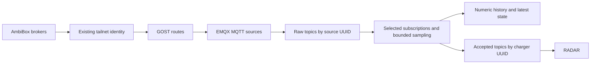

# AmbiBox catalog and collection

The Data sources page is the collection control plane. Administrators can build a
catalog in the UI, import/export JSON, choose chargers and sensors, preview the
write budget, and apply a revision. Other verified users can inspect it. The
catalog is installation-wide; this iteration does not introduce organization
isolation or other providers.

The database holds the authoritative configuration and its revision history.
Exported JSON is a portable catalog, not a second runtime configuration source.
Credentials, allowed broker hostnames and network access remain operator settings.
The infrastructure provisions controller access for dev, WSL and production;
production MQTT TLS policy remains specific to production.
The UI never receives vendor or management credentials.

## Identity and data path



Each broker has a source UUID. Each charger has an application UUID and a local
ID within that broker. Several brokers can all expose local charger `0` without
colliding. Do not reuse a charger UUID for a different physical device.

EMQX subscribes to `device/evCharger/+/#` for each enabled broker. Its rule admits
only concrete topics declared in that broker's catalog and payloads up to 4096
bytes. It wraps the scalar payload with broker receive time and the upstream
retained flag, then republishes it to
`ingress/ambibox/<source_uuid>/<upstream_topic>` with local retention enabled.
The proxy subscribes only to selected exact raw topics. Unselected sensors on an
otherwise enabled broker may still use network and EMQX capacity; they do not
reach the proxy callback or database. A broker with no selected sensors is disabled.

Accepted numeric messages use
`device/evCharger/<charger_uuid>/<sensor_key>` with `{value, timestamp}`. The
proxy never subscribes to this output, preventing feedback loops. Application
monitoring starts only for selected numeric topics in an applied collection.

## Collection semantics and limits

- **Off:** no proxy subscription, storage, or accepted MQTT output.
- **Original rate:** numeric observations enter a bounded queue. Overload drops
  new observations and increments the visible drop counter. This is best-effort
  telemetry, not a lossless durable transport. History uses broker receive time
  at millisecond precision and one row per charger, sensor and timestamp.
- **Latest every N seconds:** keep one pending observation per selected stream;
  emit the newest observation when its interval becomes due. Preserve its broker
  receive timestamp. Do not average, forward-fill, or repeat quiet streams.
- **Text, boolean, identifier:** update latest state only. At original rate these
  state updates are coalesced to at most one per second. Sampling uses its selected
  interval. These values do not enter numeric history or RADAR.
- **Retained messages:** refresh latest state as snapshots, never numeric history
  or RADAR input. Their original measurement age is unknown. Both the upstream
  retained flag and local replay flag are checked. Only admitted live observations
  (numeric or state) update charger contact status; retained snapshots do not.

Sampling limits accepted observations and history growth. It does not reduce the
publisher's rate or EMQX ingress rate for a partially selected broker. Each numeric
history point also updates a latest-state row, so the preview estimates history
rows, not the total number of database operations.

The initial limits are 128 brokers, 4096 catalog sensors, 128 sensors per charger,
and a bounded original-rate queue (default 10000). Inputs are validated before
admission; counters show invalid, coalesced and overload-dropped messages. A failed
DB write retains bounded batches and applies backpressure. Queues are in memory:
process loss can lose pending observations. Accepted MQTT publishing uses QoS 1
but is not transactionally coupled to a DB commit; no outbox guarantee is claimed.

## Storage and retention

The Data sources page shows the database's measured size and the persisted
retention policies for telemetry and monitoring evidence. It reports missing or
paused policies explicitly. Use **Refresh storage** to obtain a new measurement;
size is not queried on every collection-status poll. Database size includes all
application tables and indexes, but not backups, WAL, or server logs. These two
retention policies do not limit the lifetime of accounts, catalogs, or anomalies.

`TELEMETRY_RETENTION_DAYS` (1–365, default 14) remains an operator deployment setting.
Change it and restart/redeploy DB Sync to apply the new value to **existing** tables
as well as fresh databases. Startup creates missing policies and updates the two
managed jobs in place, preserving job IDs and schedules. It also re-enables a
paused managed job. Other retention jobs are left alone. Policy reconciliation is
part of the schema transaction; a failure keeps DB Sync unready.

Both increasing and decreasing the period are supported. Increasing it cannot
recover deleted data. Decreasing it makes old data eligible for TimescaleDB's next
scheduled cleanup, which removes whole time chunks; the duration is not an exact
per-row deletion deadline. Startup does not explicitly execute cleanup; the scheduler controls when it runs.

## Applying a revision

A save uses an expected revision and a PostgreSQL advisory transaction lock.
Concurrent edits receive a conflict instead of silently overwriting each other.
Catalog changes and monitor starts use the same lock.

The proxy pauses admission, drains already admitted DB and MQTT output, installs
subscriptions and reports `prepared`. TACTIC then reconciles per-source routes,
connectors and rules. After the ingress revision is applied, the proxy enables
collection, requests retained snapshots again and reports `applied`. Failures stay
visible and retry. Broker/topic changes disable ingress and clear the previous
retained cache before replacing the binding. Failed cleanup keeps its retry marker;
an already-empty cache counts as success. An empty selection is healthy idle.

Latest state is a cache: it is hidden during the transition and rebuilt for the
selected bindings. Numeric history is independent of that cache. Changes to
source bindings, selected inputs, value types, or sampling cadence identify affected
monitors. Applying requires explicit acknowledgement to stop those monitors;
restart them with fresh calibration. Unrelated monitors continue running.

The controller owns only resources named `offkey_ambibox_<source UUID hex>` and its
GOST chain. Other EMQX resources are not reconciled or deleted. Only one ingress
controller and one collection worker may own a database at a time. Ownership
connections use PostgreSQL advisory locks and stop work if the connection is lost.

## Initial catalog and local development

The bundled AmbiBox inventory contains 31 candidate hosts from the development
inspection. Four brokers were observed; sensor definitions on the others are
unverified assumptions. All chargers start paused. Loading it does not scan the
network or automatically subscribe to the hosts. Select the observed chargers or
other known endpoints and apply a collection policy.

For a local Compose stack, import `dev/ambibox/local-catalog.json` instead. It
matches the existing simulator's two chargers on `source-broker:1883`. Start the
simulator profile, select those chargers in Data sources, set a policy, review and
apply. The simulator publishes scalar AmbiBox-style payloads. The default standalone
RADAR example points to the first charger UUID in this catalog; normal monitoring
should be created through the UI.

Production reuses the singleton vendor Tailscale/Headscale service and its persisted
state. The infrastructure deployment transfers the existing MQTT credentials once
from EMQX into a private `ambibox-access.json` file and targeted Swarm secrets. It
also generates private internal EMQX/GOST management credentials. This does not
request another vendor tailnet key. If MQTT credentials are supplied explicitly,
use the existing pair in the Ansible vault. Credential rotation is an operator
operation; update the private access file and redeploy its versioned secrets.

## One-time clean cutover

This release deliberately has no charger-ID aliasing or legacy forwarding path.
Build and deploy the application and infrastructure changes together.

1. Stop managed RADAR workloads through the application. Keep the existing EMQX
   connector until infrastructure has transferred its credentials.
2. Deploy the new images and infrastructure. Let DB Sync create the new tables.
   Preserve the existing vendor tailnet state/NFS volume and singleton placement.
3. Stop TACTIC and MQTT Proxy while resetting development data. Run
   `dev/ambibox/reset-development.sql` with `psql` against the intended database.
   It refuses running collection locks or active monitor records and clears
   charger/telemetry/monitoring/catalog data while preserving accounts and the
   model registry. This is an explicit operator action, never a startup migration.
4. Remove the old EMQX rule `rule_besa`, source `mqtt:Ambibox` and connector
   `mqtt:ambibox` after confirming the credential transfer. Environments using the
   old development helper may instead have source `mqtt:ambibox-wildcard`; remove
   its referring rule first. Remove the old retained `device/evCharger/0/#` cache.
   Do not delete the new controller-owned resources or vendor identity.
5. Restart TACTIC and MQTT Proxy. Sign in as the configured verified administrator,
   open Data sources, load/build/import the catalog, select sensors and review the
   estimated history volume. Apply and wait for both workers' matching revision.
6. Check each selected broker's connection state, latest observations and numeric
   charts. Start new monitors using the new charger UUIDs.

An unexpired existing tailnet identity and broker credentials are reused; revoked
access or previously unseen broker ACLs still require the provider to resolve them.
A visible tailnet peer alone does not prove that its MQTT broker is reachable.

## Verification

The isolated fixture uses two Mosquitto brokers, GOST/SOCKS, real EMQX and a disposable
TimescaleDB. It never reads application database credentials:

```bash
docker compose -f backend/tests/collection_integration/compose.yml up -d --wait
OFFKEY_COLLECTION_INTEGRATION=1 uv run --project backend python -m pytest \
  backend/tests/collection_integration -q
docker compose -f backend/tests/collection_integration/compose.yml down -v
```

Set `EMQX_TEST_IMAGE=emqx/emqx:6.3.1` when checking the development broker version;
the default fixture is production's EMQX 5.8.7. Run `down -v` between broker
versions so a downgrade never reuses a newer EMQX data directory. Tests cover identity isolation,
retention, sampling, pause, reconnect, idle state, API authorization, concurrent
saves and affected monitor acknowledgement.

Implementation verification on 27 September 2026: 609 backend tests passed (four
opt-in tests skipped in that run), 183 frontend tests passed, and 15 infrastructure
checks passed. Frontend lint/build, pre-commit, all four Compose models, and both
Terraform roots also passed. Terraform validation used Linux to match the locked
provider packages in CI.

The two collection integration tests passed separately on EMQX 5.8.7 and 6.3.1,
including topic remapping, state-only liveness, and cleanup of empty retained caches.
The full local Docker stack passed all nine browser smoke tests with test retries
disabled, two additional consecutive charger-ingress runs, and the adaptive backend
lifecycle E2E. Existing verified and pending-registration accounts were reused to
check retry behavior. Desktop/mobile catalog editing was checked in Chromium with
mocked API responses; authenticated catalog changes were checked against PostgreSQL.
The guarded reset was exercised only in the disposable fixture, and the packaged
TACTIC wheel includes the inventory. Production and the live vendor fleet were not
changed.

An Astra Max thermonuclear review identified six actionable issues: deployment
coverage, CI configuration, retained cleanup retries, charger contact status,
credential refresh, and repeatable E2E setup/cleanup. All were corrected and the
reviewer's focused follow-up found no remaining actionable findings. The full
reruns additionally caught and corrected empty-cache cleanup and async test setup.
