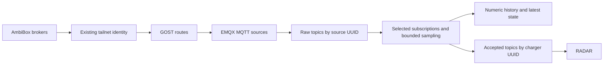

# AmbiBox catalog and collection

The Data sources page is the collection control plane. Administrators can build a
catalog in the UI, import/export JSON, choose chargers and sensors, and save
definitions and collection settings together. Other verified users can inspect it. The
catalog is installation-wide; this iteration does not introduce organization
isolation or other providers.

The database holds the authoritative configuration and its revision history.
Exported JSON is a portable catalog, not a second runtime configuration source.
Credentials, allowed broker hostnames and network access remain operator settings.
The integrated production infrastructure provisions controller access;
production MQTT TLS policy remains specific to production.
The UI never receives vendor or management credentials.

## Identity and data path



Each broker has a source UUID. Each charger has an application UUID and a local
ID within that broker. Several brokers can all expose local charger `0` without
colliding. Do not reuse a charger UUID for a different physical device.

EMQX subscribes to `device/evCharger/+/#` for each enabled broker. Its rule admits
only concrete topics declared in that broker's catalog and payloads up to 4096
bytes. It wraps the scalar payload with broker receive time and the upstream
retained flag, then republishes it to
`ingress/ambibox/<source_uuid>/<upstream_topic>` with local retention enabled.
The proxy subscribes only to selected exact raw topics. Unselected sensors on an
otherwise enabled broker may still use network and EMQX capacity; they do not
reach the proxy callback or database. A broker with no selected sensors is disabled.

Accepted numeric messages use
`device/evCharger/<charger_uuid>/<sensor_key>` with `{value, timestamp}`. The
proxy never subscribes to this output, preventing feedback loops. Application
monitoring starts only for selected numeric topics in an applied collection.

## Collection semantics and limits

- **Off:** no proxy subscription, storage, or accepted MQTT output.
- **Original rate:** numeric observations enter a bounded queue. Overload drops
  new observations and increments the visible drop counter. This is best-effort
  telemetry, not a lossless durable transport. History uses broker receive time
  at millisecond precision and one row per charger, sensor and timestamp.
- **Latest every N seconds:** keep one pending observation per selected stream;
  emit the newest observation when its interval becomes due. Preserve its broker
  receive timestamp. Do not average, forward-fill, or repeat quiet streams.
- **Text, boolean, identifier:** update latest state only. At original rate these
  state updates are coalesced to at most one per second. Sampling uses its selected
  interval. These values do not enter numeric history or RADAR.
- **Retained messages:** refresh latest state as snapshots, never numeric history
  or RADAR input. Their original measurement age is unknown. Both the upstream
  retained flag and local replay flag are checked. Only admitted live observations
  (numeric or state) update charger contact status; retained snapshots do not.

Sampling limits accepted observations and history growth. It does not reduce the
publisher's rate or EMQX ingress rate for a partially selected broker. Each numeric
history point also updates a latest-state row, so the preview estimates history
rows, not the total number of database operations.

The initial limits are 128 brokers, 4096 catalog sensors, 128 sensors per charger,
and a bounded original-rate queue (default 10000). Inputs are validated before
admission; counters show invalid, coalesced and overload-dropped messages. A failed
DB write retains bounded batches and applies backpressure. Queues are in memory:
process loss can lose pending observations. Accepted MQTT publishing uses QoS 1
but is not transactionally coupled to a DB commit; no outbox guarantee is claimed.

## Storage and retention

The Data sources page shows the database's measured size and the persisted
retention policies for telemetry and monitoring evidence. It reports missing or
paused policies explicitly. Use **Refresh storage** to obtain a new measurement;
size is not queried on every collection-status poll. Database size includes all
application tables and indexes, but not backups, WAL, or server logs. These two
retention policies do not limit the lifetime of accounts, catalogs, or anomalies.

`TELEMETRY_RETENTION_DAYS` (1–365, default 14) remains an operator deployment setting.
Change it and restart/redeploy DB Sync to apply the new value to **existing** tables
as well as fresh databases. Startup creates missing policies and updates the two
managed jobs in place, preserving job IDs and schedules. It also re-enables a
paused managed job. Other retention jobs are left alone. Policy reconciliation is
part of the schema transaction; a failure keeps DB Sync unready.

Both increasing and decreasing the period are supported. Increasing it cannot
recover deleted data. Decreasing it makes old data eligible for TimescaleDB's next
scheduled cleanup, which removes whole time chunks; the duration is not an exact
per-row deletion deadline. Startup does not explicitly execute cleanup; the scheduler controls when it runs.

## Applying a revision

The production release applies packaged SQL migrations transactionally before the
new application starts. Do not apply individual SQL files manually. See
[Production releases](production.md) for the upgrade and maintenance sequence.

Affected monitor stop requests are committed before Docker removal. Each completed
stop is saved independently; the catalog revision changes only after every stop
succeeds. If a stop or catalog write fails, completed stops remain stopped and the
previous catalog stays active. The status reconciler retries pending stops after
failures or restarts. Retry the catalog save after those stops finish, then restart
the monitors with fresh calibration.

A save uses an expected revision and a PostgreSQL advisory transaction lock.
Concurrent edits receive a conflict instead of silently overwriting each other.
Catalog changes and monitor starts use the same lock.

The proxy pauses admission, drains already admitted DB and MQTT output, installs
subscriptions and reports `prepared`. TACTIC then reconciles per-source routes,
connectors and rules. After the ingress revision is applied, the proxy enables
collection, requests retained snapshots again and reports `applied`. Failures stay
visible and retry. Broker/topic changes disable ingress and clear the previous
retained cache before replacing the binding. Failed cleanup keeps its retry marker;
an already-empty cache counts as success. An empty selection is healthy idle.

Latest state is a cache: it is hidden during the transition and rebuilt for the
selected bindings. Numeric history is independent of that cache. Changes to
source bindings, selected inputs, value types, or sampling cadence identify affected
monitors. Applying requires explicit acknowledgement to stop those monitors;
restart them with fresh calibration. Unrelated monitors continue running.

The controller owns only resources named `offkey_ambibox_<source UUID hex>` and its
GOST chain. Other EMQX resources are not reconciled or deleted. Only one ingress
controller and one collection worker may own a database at a time. Ownership
connections use PostgreSQL advisory locks and stop work if the connection is lost.

## Initial catalog and local development

The bundled AmbiBox template contains one fictional broker and charger, with
standard sensor definitions and collection paused. Replace its broker details
before saving. It makes no claim that a real broker or sensor has been observed.
Existing production catalogs stay in the database and are preserved by deployment.

For a local Compose stack, import `dev/ambibox/local-catalog.json` instead. It
matches the existing simulator's two chargers on `source-broker:1883`. Start the
simulator profile, select those chargers in Data sources, set a policy, and save
changes. The simulator publishes scalar AmbiBox-style payloads. The default standalone
RADAR example points to the first charger UUID in this catalog; normal monitoring
should be created through the UI.

Production reuses the singleton vendor Tailscale/Headscale service and its persisted
state. The infrastructure deployment transfers the existing MQTT credentials once
from EMQX into a private `ambibox-access.json` file and targeted Swarm secrets. It
also generates private internal EMQX/GOST management credentials. This does not
request another vendor tailnet key. If MQTT credentials are supplied explicitly,
use the existing pair in the Ansible vault. Credential rotation is an operator
operation; update the private access file and redeploy its versioned secrets.

## Deployment and development reset

Use the [GitHub setup guide](github-setup.md) for the first controlled production
cutover. Production upgrades preserve the saved catalog, telemetry and monitoring
evidence, and restart active monitors with the same settings and fresh calibration.
Vendor Tailscale identity and broker credentials are reused. Revoked access or
previously unseen broker ACLs still require the provider to resolve them; a visible
tailnet peer alone does not prove its MQTT broker is reachable.

For an intentional **development-only** reset, stop TACTIC and MQTT Proxy and run
`dev/ambibox/reset-development.sql` against the disposable development database.
It refuses active collection locks or monitor records, preserves accounts and the
model registry, and clears collection/monitoring history. It is never a production
startup migration.

## Continuous integration

The MQTT Collection Integration workflow runs the isolated two-broker fixture for
EMQX 5.8.7 (production) and 6.3.1 (development) on every PR, main push and merge group.
It exercises broker identity isolation, sampling, retained snapshots, reconnects,
pausing, authorization and revision conflicts. Each matrix job owns its disposable
brokers/database and removes the containers and volumes even after failure.

A focused write-outage test holds a real PostgreSQL lock on telemetry while MQTT
continues delivering traffic. It checks fixed queue and task bounds during sustained
load, observes deliberate overflow drops, releases the lock and requires a new
measurement to reach the database. It uses only the fixture's localhost endpoints
and synthetic credentials; no vendor tailnet or production data is involved.

## Verification

The isolated fixture uses two Mosquitto brokers, GOST/SOCKS, real EMQX and a disposable
TimescaleDB. It never reads application database credentials:

```bash
docker compose -f backend/tests/collection_integration/compose.yml up -d --wait
OFFKEY_COLLECTION_INTEGRATION=1 uv run --project backend python -m pytest \
  backend/tests/collection_integration -q
docker compose -f backend/tests/collection_integration/compose.yml down -v
```

Set `EMQX_TEST_IMAGE=emqx/emqx:6.3.1` when checking the development broker version;
the default fixture is production's EMQX 5.8.7. Run `down -v` between broker
versions so a downgrade never reuses a newer EMQX data directory. Tests cover identity isolation,
retention, sampling, pause, reconnect, idle state, API authorization, concurrent
saves and affected monitor acknowledgement.

## Collection diagnostics

The Data Sources page reports the **saved** catalog's state separately from any
unsaved draft. It distinguishes a paused selection, a lost local MQTT connection,
unavailable upstream brokers, ready-but-quiet topics, invalid payloads, queue
pressure and database retries. Stale worker heartbeats are explicitly reported;
old measurements are never presented as current health.

Recent rates use elapsed wall time over approximately 30 seconds, measured by the
worker with a fixed-size sample buffer. Incoming means messages reaching selected
application subscriptions, not every message handled by EMQX. Accepted means
observations emitted after sampling (including latest state and retained snapshots).
Numeric rows written counts successful inserts, and the last telemetry/state commit
advances only after a successful database commit, including state-only sensors.
Lifetime counters remain visible but do not keep a recovered system in an error state.

Original-rate and database queues show occupancy and fixed capacities. Latest-sample
slots normally remain occupied until the next interval; this is expected coalescing,
not overload. During a database outage the status table may itself become unwritable:
the UI then reports stale status. The internal collector `/health/full` endpoint can
still expose live queue diagnostics without waiting for that table.


## Editing and saving the catalog

Data sources shows brokers, their chargers, and each charger's measurements in
one hierarchy. Expand **Broker settings** or **Charger settings** to edit
technical definitions. Each measurement shows its effective collection mode and
sampling interval; expand it to edit its definition. New chargers and manually
added measurements start with collection off. Copying sensor definitions replaces
the target charger's measurements and switches its collection off, as explained
next to the copy control.

Search matches broker/charger names, hostnames, IDs, sensor keys, categories, and
topics. A matching charger keeps all its sensors visible. The evidence filter
separates observed brokers from candidate hosts; observed is catalog evidence,
while live connection status is reported separately. Inventory counts come from
the current edits rather than fixed development totals.

From an empty installation, **Load AmbiBox template** creates an unsaved catalog
with collection off. Use **Configure** on a charger, or select several chargers
and choose **Configure selected**. Changing the search or evidence filter clears
this edit selection, so hidden chargers cannot accidentally be included.

The configuration panel shows a checkbox for each measurement and category.
Category checkboxes affect only their own measurements; a partial selection is
shown with an indeterminate checkbox. Unchecked measurements will be off,
including any that previously inherited an enabled default. Only the chargers
named in the panel are changed. **Clear** followed by a category checkbox is the
way to collect just that category.

When editing multiple chargers, **By category** makes the same measurement
selection across them. **By charger** lets you expand each charger and choose a
different set of sensors for it. Both views edit the same selection and preserve
individual rates. Choose a shared sampling interval or customize individual
rates. Numeric readings create chart history; text and booleans keep their latest
value only. **Done** keeps the edits on the page; **Cancel** discards edits made
inside the configuration panel. Neither saves to the server. To stop collection
for the selected chargers, choose **Clear**, **Done**, and **Save changes**.
Switching collection off does not preserve previous rates for resuming later.

**Save changes** validates and saves definitions and collection settings together.
Ordinary changes save directly. Removing a broker, charger, or measurement, or
changing streams used by running monitors, asks for confirmation describing those
consequences. Affected monitors must stop and restart with fresh calibration.
Cancelling the confirmation leaves the edits unsaved. Importing a catalog or
loading a historical revision replaces both definitions and collection settings
on the page; it does not save automatically.

A short notification confirms persistence. The save bar separately reports when
the workers are applying the saved configuration or have applied it. Save errors
leave edits available for retry. An intervening revision disables editing/saving
until the saved catalog is reloaded. Export first if you need to preserve your
edits. **Discard changes** asks before replacing unsaved edits. Browser
refresh/close and navigating away also warn about unsaved changes.

Connection and queue information is under **Live diagnostics**. Storage usage
and retention policies are under **Account → Settings**.
